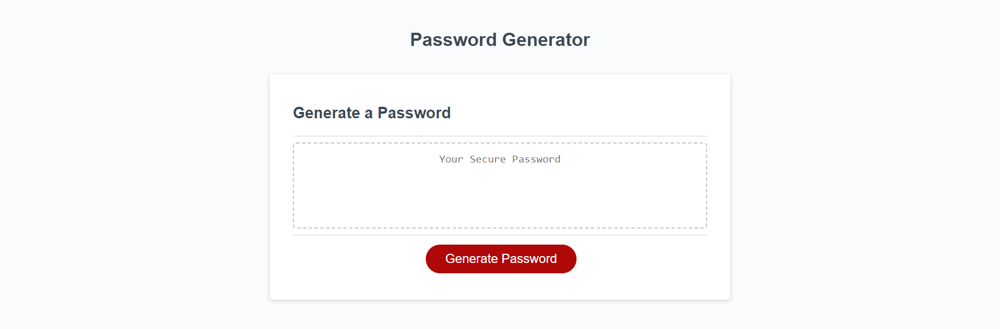

# password-generator
Using javascript to create a random password using user-specified options.

# Description
Random password generator developed in Javascript. Prompts end-user for various options before generating.

# Installation
git clone git@github.com:CLTJared/password-generator.git

# Demo / Screenshot

# License
Software provided under MIT License. See LICENSE file.